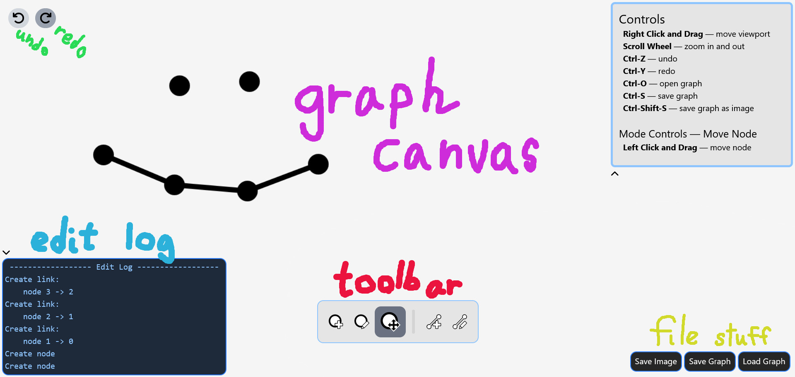

# Graph Editor

A graph editor with customizable names and descriptions for every node and edge.

There are two pages on the site:
The Make page and the View page.

## The Make Page

#### Graph Canvas (magenta):
Where your graph appears. Interact here to edit the graph. You can move the viewport by right-clicking and dragging, and zoom with the scroll wheel.

#### Controls List:
Tells you shortcuts and mode controls, depending on which mode you're in.

#### File Stuff (yellow):
Save and load graphs. Graphs can be saved in JSON format or as an image of the graph canvas (the image will look exactly as the canvas does when you press the button or use the shortcut!)

#### Edit Log (blue):
A list of the changes you've made. Certain actions will provide detail, like attributes edited, or the two nodes of an edge.

#### Undo/Redo (green):
Does what you'd expect.

#### Toolbar (red):
Where your tools are. They are, in order:
- *Add Node* — create nodes wherever you want!
- *Edit Node* — change a node's name, description or image. Their image will be drawn on in the graph, 
- *Move Node* — drag those nodes around until they get dizzy.
- *Add Edge* — link two nodes together with an edge. The power of friendship!
- *Edit Edge* — change a edge's name or description. Edges deserve a personality too.

Both the Edit Log and Controls List are minimizable, as they take up a lot of space. Click the little arrow at their side to close them, and again to open them up.

## View Page

#### Graph Canvas (magenta):
Shows you the graph. You can drag around and zoom in and out.

#### File Stuff (yellow):
Load a JSON file of a graph to view it. You can also save it as an image.

...or as JSON again. Use your hard drive space how you want, I don't care!

## Extra Info

Programmed in Svelte for Hack Club's Summer of Making program.

Read the devlogs [here](devlog/DEVLOG_1.md)! I put a lot of time into writing them :D

&copy; quantumKya 2025 (if that matters)
