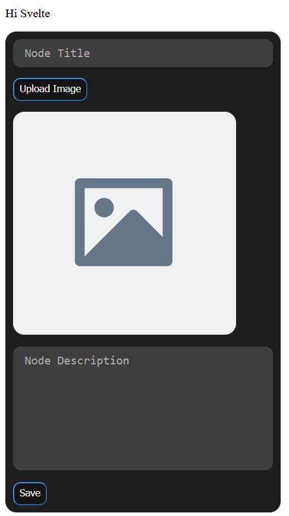
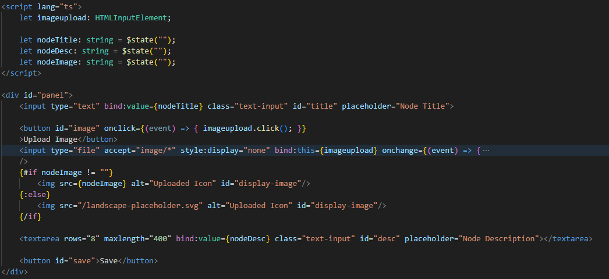

## Devlog #1 - 7/7/2025
# Hello, Svelte!

For a while, I've been interested in learning a JS framework to make a website, and I decided this is a perfect time to do so.
In the first 2 hours, I've just been getting used to Svelte.

I've made a panel for editing a node, with text fields and buttons. This is what it looks like!

Here's the code for it.

Overall, I like Svelte so far and how easy it is to make features with. Next, I'm adding a JSON file to keep track of nodes and edges, which I'll fetch data from when editing a node.

 
 

[Next Devlog -->](DEVLOG_2.md)