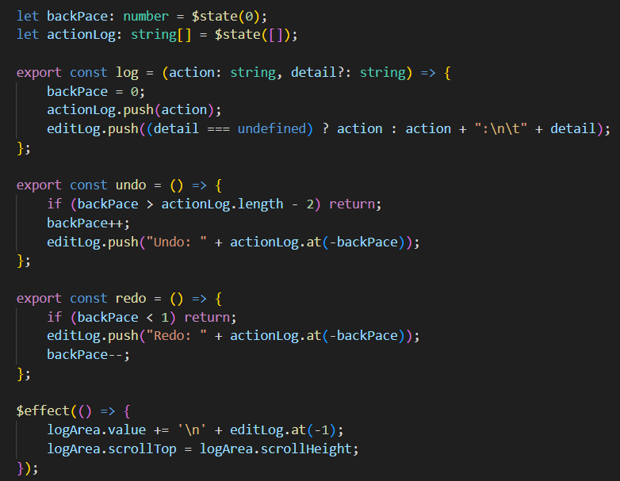
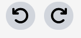

## Devlog #10 - 7/13/2025
# Undo arrays

First, I need an array of states for keeping track of changes and so that you can undo.
Here's the logic I wrote for undoing and redoing inside of the edit logger. This code only affects the edit logger because the other logic happens in the GraphEditor.

I've also added undo and redo buttons that do exactly what you'd expect. :३

Next, I'll add all of the edit messages and actual logic.

 
 

[<-- Previous Devlog](DEVLOG_9.md)<!--   [Next Devlog --\>](DNA_DEVLOG_11.md)-->