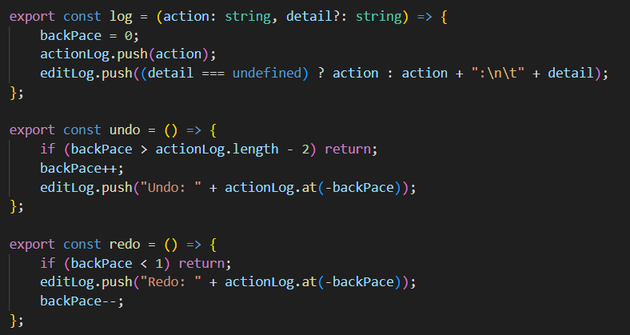
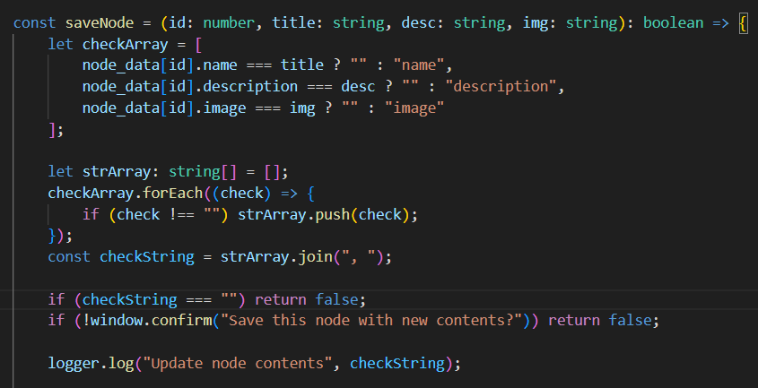

## Devlog #11 - 7/13/2025
# Sending Logs

First, I changed the log sending function to take in a main action name and then an extra details string, which is optional. This is so I can do the undo/redo messages easily.



Most of the log sending was pretty simple, with lines like
```
logger.log("Create link", `node ${linkNode.id} -> ${focusNode.id}`);
```

The only one that was more complex was the node saving one, where I had to some array-string shenanigans to get a good, clear message.



<br>
<br>

[<-- Previous Devlog](DEVLOG_10.md)   [Next Devlog -->](DNA_DEVLOG_12.md)