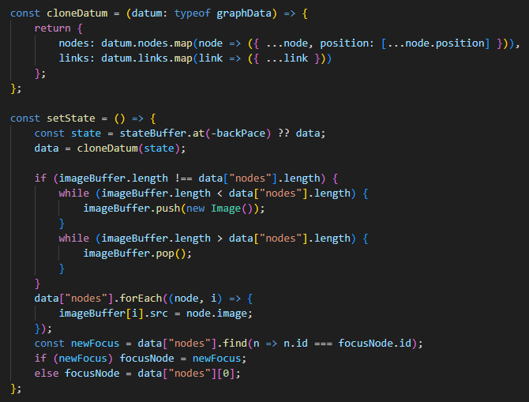

## Devlog #12 - 7/14/2025
# Undoing for real

To make undo-ing into an actual functional feature, I need an array to keep track of the state and for going back and forth.

Making the code work was a little frustrating, but I found out (by asking Copilot, sorry) that I was only storing *references* to data and not clones.
Once I fixed that, and after a BUNCH more trial and error, I got everything working fine.

I have two helper functions for saving the state.

 
 

[<-- Previous Devlog](DEVLOG_11.md)<!--   [Next Devlog --\>](DNA_DEVLOG_13.md)-->