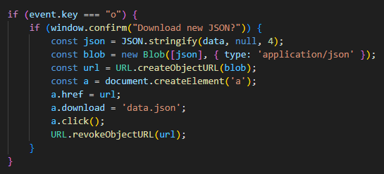
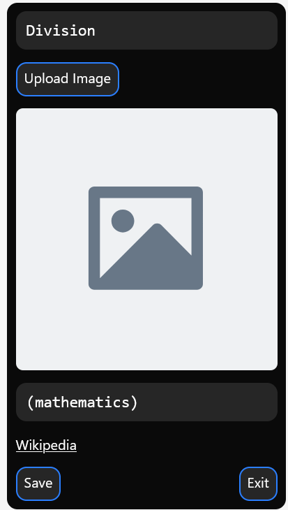

## Devlog #13 - 7/14/2025
# Miscellaneous Additions

There are a few things I need to clean up before moving on to bigger things, like editing link descriptions and a viewer for the users of the website.

- First, I need to be able to download the new graphs I make as JSON files.
- Second, I need to add... adding nodes. Currently, there's an option for it, but it doesn't do anything.
- Third, I'm switching the description option for nodes to a Wikipdia link. I don't need to write my own descriptions for those :sob:

### JSON Exporting

I did the first thing very easily with a keydown check and some link-creating;

Wow, a lot of things are called "links" in this project...

...you too, I guess.

### Adding nodes

I added the code for adding and removing nodes, and then had to make a function for updating the IDs of every node and link such that things kept the same structure regardless of removals or additions.

There are currently a few odd edge cases where deleting a node causes some links to jump to other nodes. I don't know how to fix this at the moment, but I will at some point.

### Wiki links

To replace descriptions with wiki links, I commented out the description editor and its related variables. I commented it out instead of deleting it because I need it later for the link editor.

Then I added a link and some other simple code, and boom! It's done. I have an `addend` field in case a page needs disambiguation, as in the case of `https://en.wikipedia.org/wiki/Division_(mathematics)`.

With that done, my three tiny goals are finished! Now on to bigger ones.