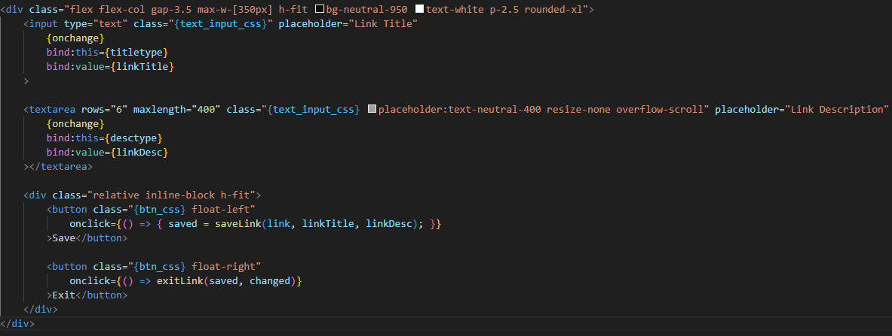
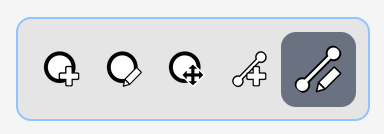
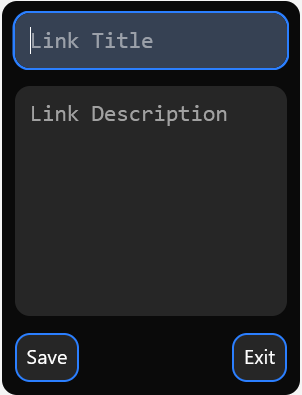

## Devlog #14
# Linking things together

In order for this to be a map of CONNECTIONS between math concepts, I need to be able to edit the links' descriptions and names.

I mostly copied the code from the NodeEditor file, but made a few tweaks to fit the links.

I also made more art for the toolbar.

It was pretty easy to make the menu and get it all working, so here it is!!!

 
 

[<-- Previous Devlog](DEVLOG_13.md)   [Next Devlog -->](DEVLOG_15.md)