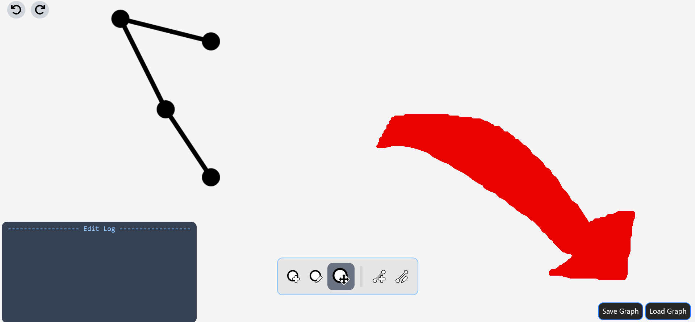

## Devlog #15 - 9/21/2025
# A Different Direction

Since Summer of Making is almost over, I decided to take this project and see what I could make of it in such short time. Since I've made so much infrastructure for graph editing, I'm making it a graph editor! Hope that isn't disappointing.

Speaking of actual changes, I've fixed the dragging and zooming!!! Also, there are now saving and loading features for the graph.

 
 

[<-- Previous Devlog](DEVLOG_14.md)   [Next Devlog -->](DEVLOG_16.md)