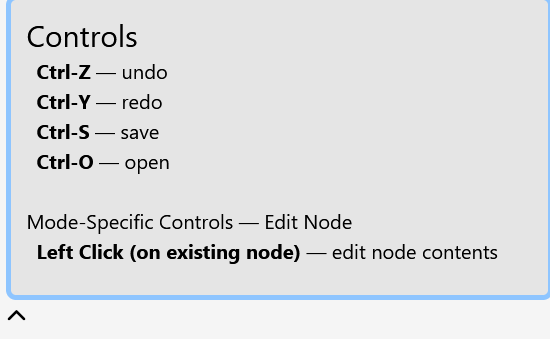

## Devlog #16 - 9/21/2025
# Quality of Graph

Things need to be easy when making graphs... So I added a controls list, which changes depending upon which tool you're using to tell you how to use it.

I also added buttons to close and open the edit log and the controls panel.

 
 

[<-- Previous Devlog](DEVLOG_15.md)   [Next Devlog -->](DEVLOG_17.md)