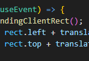

## Devlog #2 - 7/8/2025
# Trial and error

These last few hours have been really annoying.
First off, I was dealing with some really stupid importing bugs that I spent upwards of an hour fixing.
Then, I was having plenty of issues with drawing the nodes and links to the screen.

Once the draw function was done, I had to work out the issues in the dragging of the screen. Sometimes, the mouse would send you flying, and with slightly different code, it wouldn't. Two plus signs are what fixed it. That's it.

I was very relieved when I finally got done and was able to easily edit the nodes, dragging them around and moving the screen smoothly.

I've added the GraphEditor screen and the NodePanel for editing node content, next I just have to put them together! Thanks for reading.

 
 

[<-- Previous Devlog](DEVLOG_1.md)   [Next Devlog -->](DEVLOG_3.md)