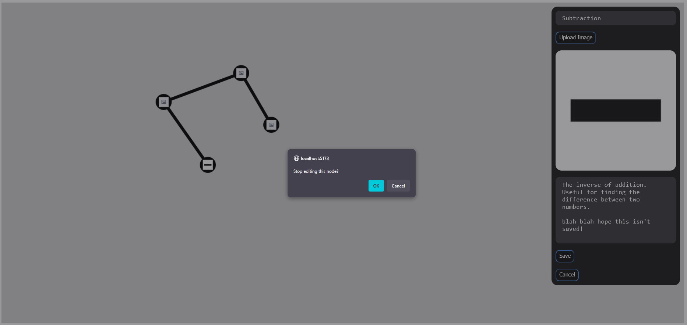
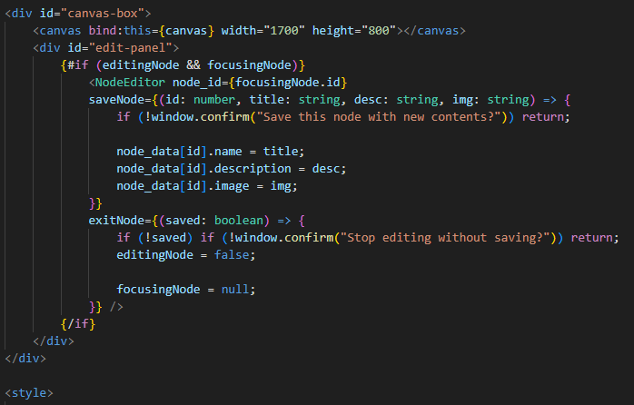

## Devlog #3 - 7/8/2025
# Getting somewhere

I feel like I'm really getting the hang of Svelte now. I pretty easily added a bunch of stuff.

Now, you can right-click to open the editing menu, and there are buttons for save and exit. It'll warn you if you exit without saving, and it'll also ask confirmation when you click save.

The only tricky thing I faced in this stage was using the wrong button index in my onmousedown function!! Apparently, 1 is middle button and *2* is right click.

The code for saving nodes was as simple as this! It'll be harder probably when I hook it up to a server or whatever, but for now it was easy.

Thanks for reading!

 
 

[<-- Previous Devlog](DEVLOG_2.md)   [Next Devlog -->](DNA_DEVLOG_4.md)