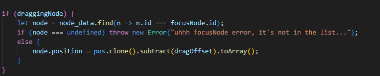

## Devlog #4 - 7/8/2025
# Escaping the Deep State

Svelte's `$state` functionality is amazing and can be very helpful. One thing it *doesn't* help with, however, is changing data by reference. I originally was using the `focusNode` variable to store the node you were editing, but I turned it to a state variable and it suddenly stopped working. It took me a while to fix, but now I'm done and this was my solution.

I've also been working on a toolbar at the bottom of the screen for switching between editing modes, which is currently unfinished.

 
 

[<-- Previous Devlog](DEVLOG_3.md)   [Next Devlog -->](DNA_DEVLOG_5.md)