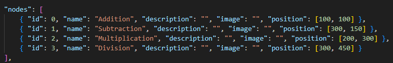

## Devlog #4 - 7/8/2025
# Escaping the Deep State

I just spent an hour messing around with stupid GitHub deployment stuff, but now it's all fine... I won't need to do any of this stuff for a while, luckily.

I had to remove the images from the nodes in order for it to work.

 
 

[<-- Previous Devlog](DEVLOG_4.md)<!--   [Next Devlog --\>](DNA_DEVLOG_6.md)-->