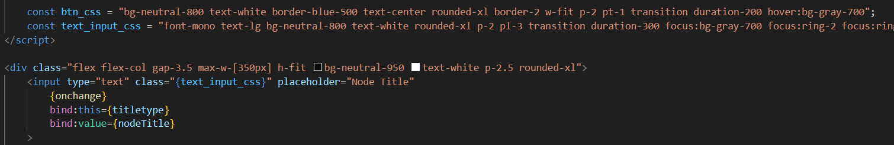

## Devlog #6 - 7/9/2025
# Hello, Tailwind CSS!

I've heard of Tailwind before, but never knew how cool it was! I installed it in this project to try it out, and I love it so much that I changed most of my CSS to Tailwind. I love its syntax and intuitive naming system.

For ease of repetition, I defined the css strings in my TS, and used them in the classes of HTML objects.

 
 

[<-- Previous Devlog](DEVLOG_5.md)   [Next Devlog -->](DNA_DEVLOG_7.md)