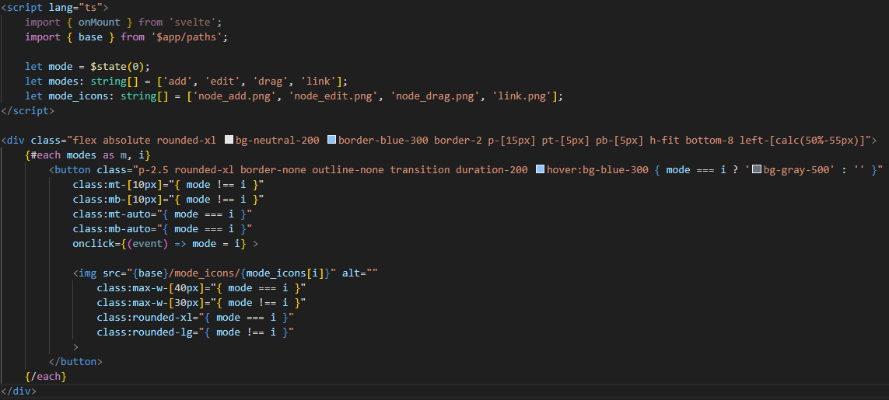
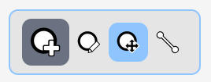

## Devlog #7 - 7/9/2025
# **Switch**ing things up

An editor requires different ways of doing things. Here, there needs to be a way to:
- Add nodes
- Edit nodes' data
- Drag nodes
- Change linkings between nodes

I decided to make a separate component for the toolbar, and the code really showed me how nice of a combo Svelte and Tailwind are. This is all the code I needed to make a great-looking menu.

This is the result. Dark gray means selected, and blue means hovering over.

Currently the buttons don't *do* anything, but that's coming up next!

 
 

[<-- Previous Devlog](DEVLOG_6.md)   [Next Devlog -->](DNA_DEVLOG_8.md)