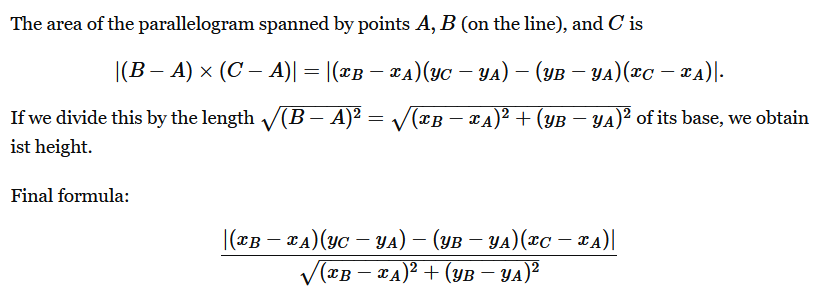
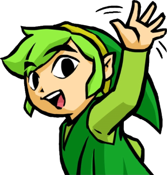

## Devlog #8 - 7/12/2025
# Hello, Links!

Today, I started out trying to implement zooming, but it got frustrating and I decided to switch to making link editing.

I want to be able to create a new link by clicking on one node and then clicking on another.
I want to be able to delete a link by clicking on it.

While making a new link, a little ghost path will follow the mouse to show what the link will look like.

To find out when you're clicking an existing link, I needed to calculate the distance of the mouse's position to the link line. I didn't know how to do this at first, so I copied a Math Stack Exchange answer.

Essentially, you find the area of the parallelogram spanned by the three points and then divide by the parallelogram's base length to get its height.
So I wrote a function for it. I had to add some code for erasing extraneous cases where the mouse was DEFINITELY not on the line but the math said otherwise.

Unfortunately, now, whenever you drag the canvas, it jitters a bit. I don't know how to fix this :sob:

 
 
 
 

Oh, hi! I was talking about the node links, though, not you guys.

 
 

[<-- Previous Devlog](DEVLOG_7.md)<!--   [Next Devlog --\>](DNA_DEVLOG_9.md)-->
