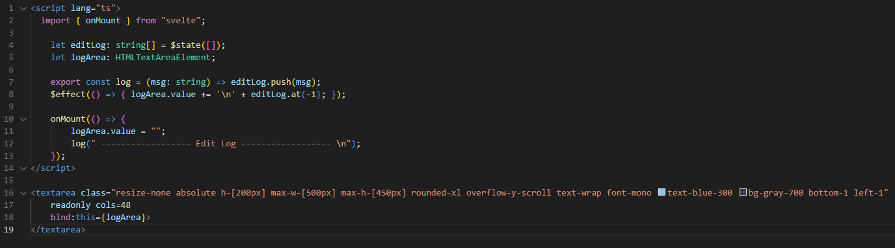

## Devlog #9 - 7/13/2025
# A Logger w/o Deforestation!!!

One of the things I had on my to-do list was to add an undo button. This means I have to keep track of the state at all times.
First, I'm going to make a Godot-style edit log to show what you're doing. The code is pretty simple; it exports a function for other components to use to send messages.

### Side Note:

I changed the draw function to instead be an `$effect()` function. This way, it only updates when it needs to rather than running all that code every frame.

### Side note over.

Now, different parts of code can call its function, and send a message to be put in the log! It only needs to be this simple.

Next is to fill in messages where they should be sent and, of course, fix any issues that come up lol :D

 
 

[<-- Previous Devlog](DEVLOG_8.md)<!--   [Next Devlog --\>](DNA_DEVLOG_10.md)-->